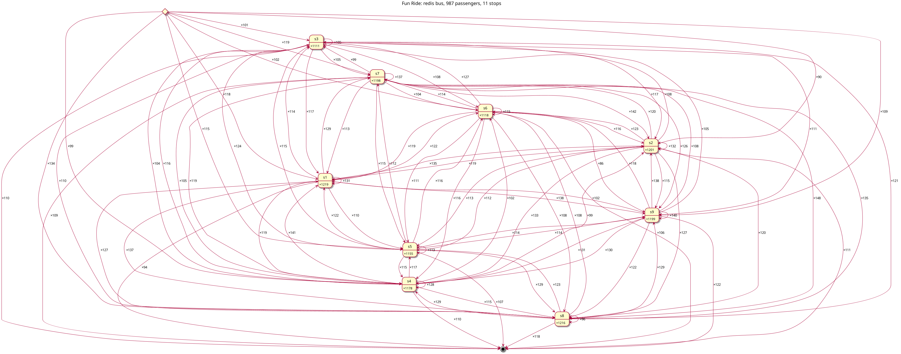

# bus ride fun

## how to have a joy ride

```
make tea
```

example output (reduced):

```
* oO0OoO0OoO0Oo Redis is starting oO0OoO0OoO0Oo
Starting service with args: (service_id='X', service_type='catcher', bus_type='redis', bus_connection={'host': 'redis', …
Starting service with args: (service_id='0', services_list=['1', '2', '3', '4', '5', '6', '7', '8', '9'], service_type='kicker' …

…
kicking the bus: #1 ·→[16]
kicking the bus: #10000 ·→[30]

catched (106): #3071 payload=tPfxhVOYNe tt=0:01 log=|3/3|=0;39
catched (9999): #5938 payload=txysBQvcdo tt=0:33 log=|428/52|=0;13;48;1;9;22;1;15;18;38;24;39;34;42;
catched (10000): #8465 payload=ZyVbOdwHJZ tt=0:33 log=|503/52|=0;7;24;18;34;30;41;22;19;7;26;21;14;
catcher finished, counter=10000

catcher stats:
  caught messages: 10000
  stops: 52
  legs: 2600
  min travel time/legs: 0/3
  max travel time/legs: 34/503
  avg travel time/legs: 16.70/52.16
  most common stops: 20×10246; 14×10233; 41×10201; 3×10181; 12×10181;
  most common legs: 3→12×263; 23→36×248; 28→50×245; 35→23×243; 8→34×239;

```

## ride with kafka

```
make tea MESSAGES=1000 WORKERS=10 BUS_TYPE=kafka
```
example output (reduced):

```
===> Launching ...
===> Using provided cluster id 5L6g3nShT-eMCtK--X86sw ...
Starting service with args: (service_id='X', services_list=[], service_type='catcher', bus_type='kafka', bus_connection={'bootstrap_servers':…
Starting service with args: (service_id='7', services_list=['1', '2', '3', '4', '5', '6', '7', '8', '9', '10', 'X'] …

kicking the bus: #1 ·→[10]
kicking the bus: #2 ·→[6]

catched (998): #905 payload=YOPKKDDYnB tt=0:23 log=|70/12|=0;4;7;4;3;8;8;1;7;6;1;2;4;6;10;10;2;1;4;
catched (999): #886 payload=iiFeNeeiNK tt=0:23 log=|69/12|=0;5;8;3;7;4;7;6;5;8;2;7;8;9;7;6;4;2;7;2;
catched (1000): #938 payload=knFbjWvXDf tt=0:29 log=|115/12|=0;5;2;2;9;10;10;3;8;10;5;5;2;2;5;8;5;1
catcher finished, counter=1000
catcher stats:
  caught messages: 1000
  stops: 12
  legs: 120
  min travel time/legs: 7/3
  max travel time/legs: 29/115
  avg travel time/legs: 11.19/13.25
  most common stops: 9×1169; 4×1151; 1×1144; 3×1139; 8×1136; 10×1127; 7×1116; 2×1095; 6×1091; 5×108
  most common legs: 9→8×122; 7→1×122; 4→X×120; 9→2×120; 3→7×120; 10→9×119; 0→7×119; 3→9×119; 1→3×11
```

## sample ride map (redis, 987 messages, 9 stops + kicker + catcher)


